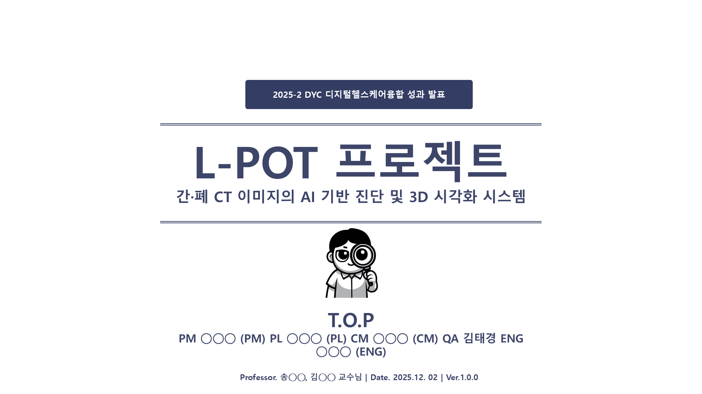
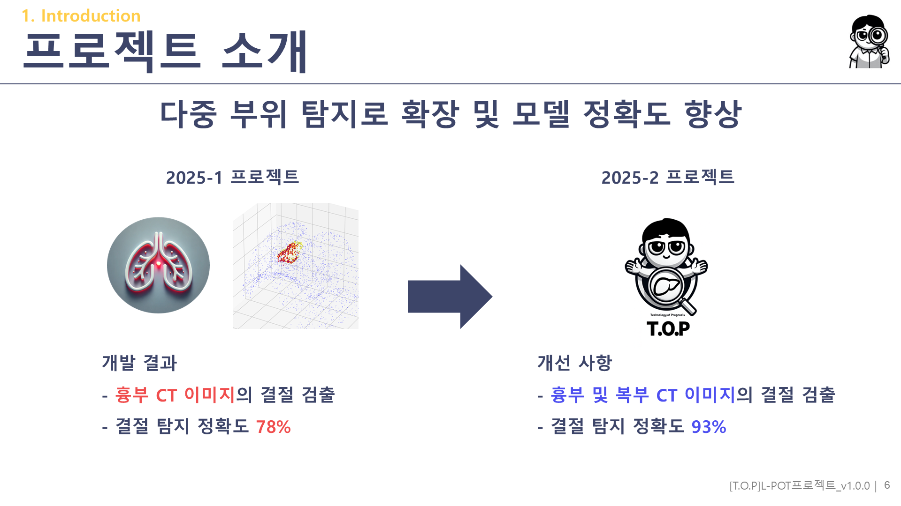
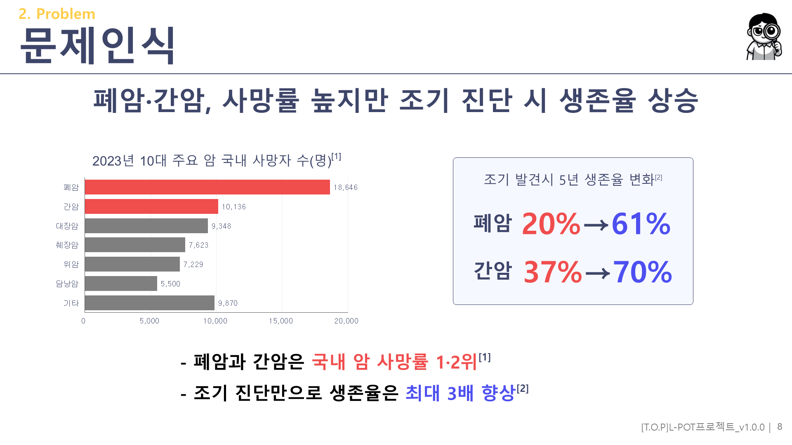
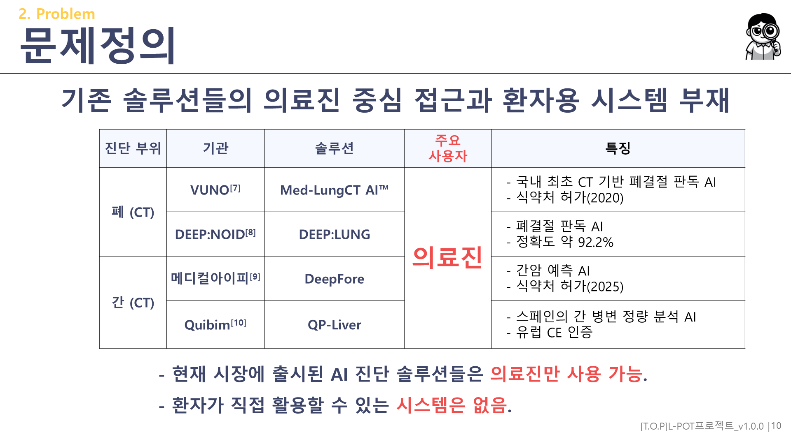
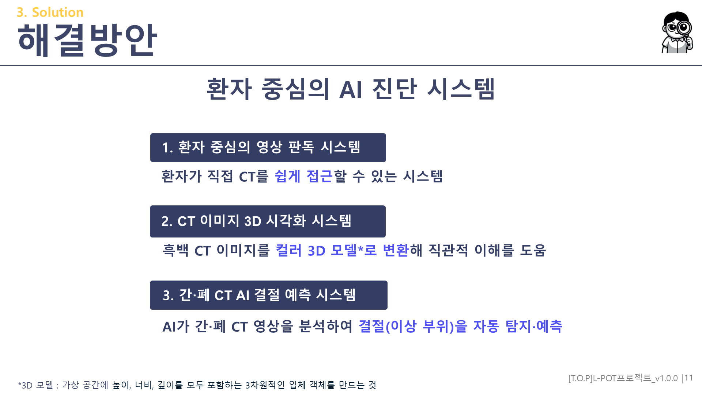
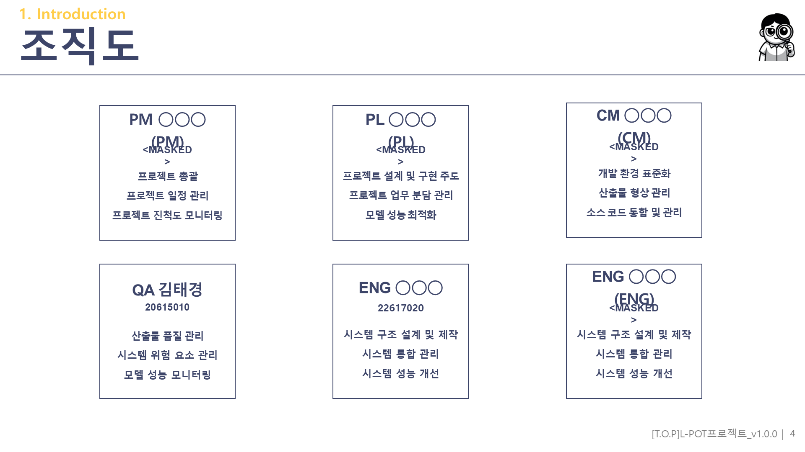
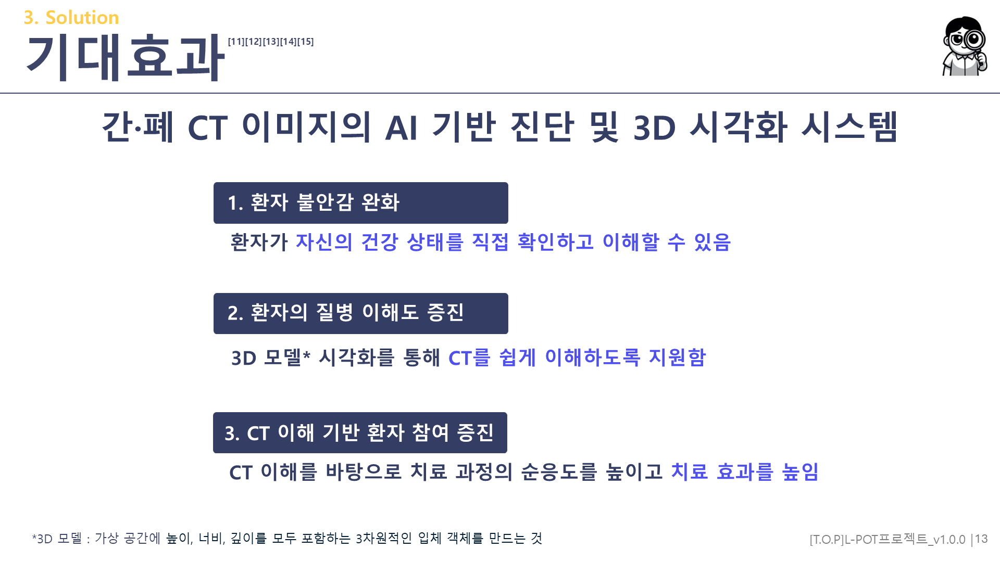

# AILungandLiver — 간·폐 CT 이미지의 AI 기반 진단 및 3D 시각화 시스템 (L-POT)

🇰🇷 한국어 · 🇬🇧 [English](README.en.md)

> *AI-Based Diagnosis and 3D Visualization System for Liver and Lung CT Images*
>
> 환자가 자신의 간·폐 CT 를 업로드하면 **3D 로 재구성하고 결절 의심 부위를 표시**해주는 PyQt6 데스크탑 앱입니다. 제품명은 **L-POT**. 직전 학기 [LungCT3DNoduleAI](https://github.com/MoriochoRadio/LungCT3DNoduleAI) (폐 only, 정확도 78%) 를 **폐+간 다중 부위로 확장하고 정확도를 93% 로 끌어올린** 후속 프로젝트입니다. 같은 팀 **T.O.P** 에서, 본인은 직전 학기 PM 에 이어 이번엔 **QA (Quality Assurance)** 를 단독으로 맡았습니다. 2025년 2학기 의료IT공학과 *융합설계 및 프로젝트* + *DYC (Design Your Class)* 두 수업 병행 결과물입니다.

       



> 최종 발표 표지 — **L-POT** · Team **T.O.P** · 2025.12.02 · Ver.1.0.0

---

## ⚠ 빌드/실행 상태에 관하여

본 레포는 **2025년 12월 발표 시점의 코드를 그대로 보존**합니다. PyQt6 + PyTorch 데스크탑 앱으로, 작성 시점에는 실행 가능했습니다.

직접 실행하려면:
- **모델 가중치** (`models/new_2.pth` 폐 54MB + `models/mask_merged_ver4.pth` 간 54MB) 는 Git LFS 로 push 되어 있습니다. clone 후 `git lfs pull` 필요.
- **학습 데이터는 포함되지 않습니다.** 공개 의료 영상 데이터 (산출물 명시 *"TCAI, Tainichi 등"*) 를 직접 준비해야 합니다.
- 실행: `python dashboard_main.py`
- 또는 PyInstaller onefile 빌드: `pyinstaller L-POT.spec` (단 `LPOT.ico` 를 프로젝트 루트에 두어야 함)

> 📌 진입점은 `dashboard_main.py` 입니다. 루트에 `main.py` 도 있지만 이것은 **실행 불가능한 이전 버전 화석**입니다 (아래 [*본인 톤이 살아있는 코드*](#-본인-톤이-살아있는-코드) 참조).

---

## 📚 프로젝트 컨텍스트

| 항목 | 내용 |
|---|---|
| **시기** | 2025학년도 2학기 (발표: 2025.12.02) |
| **소속** | 건양대학교 의료IT공학과 |
| **수업** | 융합설계 및 프로젝트 + **DYC (Design Your Class)** 두 수업 병행 |
| **팀** | **T.O.P** (Technology Of Prognosis, *"예측 기술"*) — 직전 학기 [LungCT3DNoduleAI](https://github.com/MoriochoRadio/LungCT3DNoduleAI) 와 같은 팀명 |
| **팀 구성 (5명)** | PM ◯◯◯ / PL ◯◯◯ / CM ◯◯◯ / **QA 김태경 (본인)** / ENG ◯◯◯ |
| **지도교수** | 송◯◯ 교수님 + 김◯◯ 교수님 |
| **본인 (KimTaeKyoung) 역할** | ★ **QA (Quality Assurance) 단독** — 산출물 품질 관리 · 시스템 위험 요소 관리 · 모델 성능 모니터링 |
| **★ 역할 변경** | 직전 학기 **PM** (LungCT3DNoduleAI) → 이번 학기 **QA** — *안 해본 역할을 경험하기 위해 자발적으로 선택* |

> 📌 **DYC 두 수업 병행**: 본 프로젝트는 *융합설계 및 프로젝트* 수업의 산출물이면서, 동시에 *DYC (Design Your Class)* 수업을 병행해 진행했습니다. 두 수업의 발표 시점·문서 양식이 따로 있어 같은 시스템에 대해 **발표 PPT + 학과 전시회 판넬 + DYC 디지털헬스케어융합 행사 판넬** 세 가지를 별도로 만들었습니다.

---

## 🔄 직전 프로젝트로부터의 진화 (78% → 93%)



본 프로젝트의 핵심은 직전 학기 [LungCT3DNoduleAI](https://github.com/MoriochoRadio/LungCT3DNoduleAI) 의 **연장·발전**이라는 점입니다. 발표 slide 6 에 두 학기 비교가 그대로 박제되어 있습니다:

> **2025-1 프로젝트 (개발 결과)** — 흉부 CT 결절 검출, **정확도 78%**
> **2025-2 프로젝트 (개선 사항)** — 흉부 **및 복부** CT 결절 검출, **정확도 93%**

| 항목 | 25-1 LungCT3DNoduleAI | **25-2 AILungandLiver (L-POT)** |
|---|---|---|
| 도메인 | 폐 CT 결절 | **폐 + 간 CT 결절** (다중 부위) |
| **본인 역할** | **PM** (일정·진척도·전처리) | **★ QA** (품질·위험·시험) |
| 모델 표현 | 3D Voxel | **3D Mesh / Point Cloud** |
| 프레임워크 | TensorFlow `.h5` | **PyTorch `.pth`** |
| 아키텍처 | 4-branch CNN | **SpiralNet + PointNet + Transformer hybrid** |
| **정확도** | **78%** | **★ 93%** (+15%p) |
| 인프라 | Jupyter/Colab + Streamlit | **PyQt6 데스크탑 앱 + exe** |
| 팀 | T.O.P (6명) | T.O.P (5명, 같은 팀명) |

단순히 폐 코드를 간으로 복사한 것이 아닙니다. **표현 자체를 voxel grid 에서 3D mesh 로 바꾼 재설계**이고, 노트북·웹앱에서 데스크탑 앱으로 인프라를 바꿨으며, 본인의 역할도 PM 에서 QA 로 바뀌었습니다.

---

## ❓ 문제 정의



본 프로젝트는 간·폐 진단을 둘러싼 문제에서 출발했습니다:

1. **폐암·간암 = 국내 암 사망률 1·2위** — 조기 진단 시 5년 생존율이 폐암 20%→61%, 간암 37%→70% 로 크게 상승합니다.
2. **의사 중심 의료, 환자는 수동적** — 어려운 의학 용어 판독지, 시각 자료 부족, 영상 판독까지 수일 소요. 환자는 결과 대기 중 불안 속에서 자신의 상태를 직관적으로 이해할 수 없습니다.
3. **환자용 시스템 부재** — 기존 AI 솔루션은 모두 의료진 전용입니다:



| 부위 | 기관 | 솔루션 | 사용자 |
|---|---|---|---|
| 폐 | VUNO | Med-LungCT AI™ (식약처 2020) | 의료진 |
| 폐 | DEEP:NOID | DEEP:LUNG (정확도 ~92.2%) | 의료진 |
| 간 | 메디컬아이피 | DeepFore (식약처 2025) | 의료진 |
| 간 | Quibim | QP-Liver® (유럽 CE) | 의료진 |

→ ★ 모두 의료진 전용. **L-POT 의 차별점은 *"환자가 직접 사용"***.

---

## 💡 솔루션 — L-POT



> *"환자 중심의 AI 진단 보조 시스템 — 진단을 대체하지 않고, 진단 전후의 공백을 메우는 참고 도구."*

1. **환자 중심 영상 판독** — 환자가 자신의 CT-DICOM 을 직접 업로드
2. **CT 3D 시각화** — 흑백 CT 를 컬러 3D 모델로 변환해 직관적 이해 지원
3. **간·폐 AI 결절 예측** — AI 가 결절(이상 부위) 을 자동 탐지·표시

이 포지셔닝은 본인 포트폴리오의 일관된 메시지입니다 — [MedQueue](https://github.com/MoriochoRadio/MedQueue) (환자가 직접 대기 현황 확인) 부터 L-POT (환자가 직접 CT 확인) 까지, *"의료진이 아니라 환자 본인을 위한 도구"*.

---

## 🛠️ 기술 스택

| 영역 | 기술 |
|---|---|
| **GUI** | PyQt6 (데스크탑 앱) + PyInstaller (onefile exe) |
| **딥러닝** | PyTorch (SpiralNet + PointNet + Transformer hybrid) |
| **3D 처리** | VTK · Open3D · Trimesh · scikit-image (marching cubes) |
| **의료 영상** | pydicom (DICOM) · nibabel (NIfTI) |
| **수치 연산** | NumPy · SciPy |

전체 의존성은 [`requirements.txt`](requirements.txt) 참조.

---

## 🏗️ 시스템 설계 — 폐·간 통합 OOP

L-POT 의 코드 구조에서 가장 깔끔한 부분은 **폐와 간을 OOP 추상화로 통합**한 점입니다:

```
BaseCTPipeline (공통 추상)
  ├── load_ct()                          DICOM 로드
  ├── _compute_f1()                      F1 계산
  ├── _estimate_axial_max_diameter_mm()  "병원식 축단면 최대 직경"
  └── make_result()                      결과 dict
        │
        ▼ (subclass)
OrganCTPipeline(organ: str)
  └── run(folder, model_manager, progress_cb)
        │
        ▼ (각 3줄 stub)
LungPipeline  → super().__init__("lung")
LiverPipeline → super().__init__("liver")
```

→ ★ **다중 부위 확장 = 3줄짜리 stub 두 개**. 폐 코드를 복사해 간 코드를 만든 게 아니라, 공통 로직을 부모 클래스로 빼고 장기 이름만 다르게 넘기는 구조입니다. 이게 *"voxel→mesh 재설계"* 와 함께 본 프로젝트가 단순 확장이 아니라는 증거입니다.

### 데이터 흐름

```
DICOM ZIP 업로드
  │  [utils/dicom_processor.py] zip 풀기 → HU 변환 → [1,1,1]mm resample → lung mask
  ▼
mesh 생성  [utils/mesh_processor.py — 17 free functions + MeshProcessor]
  │  marching cubes → trimesh → ICP alignment → KDTree reorder → (N,7) per-vertex features
  ▼
AI 추론  [models/model_manager.py] predict_for_organ('lung'|'liver', features)
  │  HybridSpiralNetPointNetTransformer → SpiralNet + PointNet/Transformer ensemble → sigmoid
  ▼
결과  [pipelines/common_pipeline.py] F1 + 결절 직경 mm
  ▼
3D 시각화  [pages/dashboard_page.py] matplotlib 3D + 결절 vertex 빨간색 + "임상 판독 대체 안 함" 경고
```

---

## 🤖 모델 구조 — SpiralNet + PointNet + Transformer

[`models/spiralnet.py`](models/spiralnet.py) 의 6 클래스:

| 클래스 | 역할 |
|---|---|
| `SpiralConv` | 코어 — mesh vertex 의 spiral neighbor 로 1D convolution |
| `SpiralBlock` | SpiralConv + residual + dropout |
| `SEBlock` | Squeeze-Excitation (channel attention) |
| `ImprovedSpiralNet` | encoder-decoder + SE + multi-scale |
| `SimplePointTransformerBlock` | multi-head self-attention |
| `HybridSpiralNetPointNetTransformer` | ★ 메인 — SpiralNet branch + PointNet/Transformer branch ensemble |

- **입력**: `(N_vertices, 7)` — (x,y,z) 좌표 3채널 + normal/curvature 4채널
- **출력**: `(N_vertices,)` — 결절(1)/정상(0) per-vertex 확률 (★ bounding-box 아닌 vertex-level segmentation)
- **폐/간 동일 아키텍처, 독립 가중치**: `new_2.pth` (폐) + `mask_merged_ver4.pth` (간)

> ⚠ **정직 명시**: 모델 설계·학습은 ENG/PL 팀원이 메인으로 담당했습니다. 본인 (QA) 의 역할은 모델 *성능 모니터링* — 78%→93% 검증과 품질·위험·시험 관리였습니다. 아래 [*본인 기여*](#-본인-기여-kimtaekyoung--qa-단독) 참조.

---

## ✨ 주요 기능 / UI

L-POT 는 PyQt6 데스크탑 앱입니다:
- DICOM ZIP 자동 풀기 + HU 변환 + 등방성 resample
- 폐 모드 / 간 모드 라디오 선택
- 3D 뷰어 (matplotlib 3D, 휠 줌) + 2D CT slice 슬라이더
- 결절 vertex 빨간색 강조 + F1 + 결절 최대 직경(mm)
- *"본 시스템은 임상 판독을 대체하지 않습니다"* 윤리 경고 상시 표시

### 시연 영상

<video src="assets/videos/demo.mp4" controls width="800"></video>

> 위 영상이 안 보이면 [`assets/videos/demo.mp4`](assets/videos/demo.mp4) 직접 재생 (1920×1080, 0:52 — 발표 PPT slide 12 임베드 영상).

---

## 👤 본인 기여 (KimTaeKyoung · QA 단독)

직전 학기 [LungCT3DNoduleAI](https://github.com/MoriochoRadio/LungCT3DNoduleAI) 에서 **PM** 으로 일정·진척도·산출물을 책임졌다면, 이번 학기는 **QA (Quality Assurance)** 로 품질·위험·시험을 책임졌습니다. **안 해본 역할을 일부러 골랐습니다.**



조직도상 본인 QA 직무 (slide 4): **산출물 품질 관리 · 시스템 위험 요소 관리 · 모델 성능 모니터링**.

### 트랙 1 — QA 1차 저자 산출물 37 페이지

산출물 체계표에 본인이 단독 1차 저자로 명시된 문서 5종, 통합본에서 추출한 것이 [`docs/deliverables_authored_by_kim_taekyoung.pdf`](docs/deliverables_authored_by_kim_taekyoung.pdf) (37 페이지, 팀원 PII 마스킹):

| 산출물 | 페이지 | 내용 |
|---|---|---|
| 품질 관리 계획서 | 11p | ISO 9126 기반 10 산출물 체크리스트 |
| 위험 관리 계획서 | 9p | 10 위험 항목 평가 (5개 치명적) |
| 단위 시험 계획서 | 8p | 시험 환경·시나리오 |
| 단위 시험 결과서 | 5p | 시험 결과 |

### 트랙 2 — 모델 성능 모니터링 (78% → 93%)

QA 직무의 *"모델 성능 모니터링"* 은 위 [78%→93% 진화](#-직전-프로젝트로부터의-진화-78--93) 의 검증을 의미합니다. 직전 학기 폐 only 78% 모델의 한계를 알고 있었기에, 폐+간 확장 후 93% 도달까지 성능을 추적·검증하는 것이 본인 역할이었습니다.

### 트랙 3 — ★ 위험 관리 계획서의 자기 성찰

가장 의미 있는 산출물은 위험 관리 계획서입니다. 본인이 작성한 위험 평가표 (10 항목 중 5개가 *"발생 가능성 높음 + 영향 치명적"*):

| 치명적 위험 항목 | 가능성 | 영향 |
|---|---|---|
| 모든 팀원이 CT 에 대한 이해 필요 | 높음 | 치명적 |
| **AI 모델에 대한 지식 부족** | 높음 | 치명적 |
| 모든 팀원이 딥러닝 및 CT DICOM 에 관한 이해 필요 | 높음 | 치명적 |
| 개발 환경·도구들의 연동성 필요 | 높음 | 치명적 |
| **전처리에 대한 지식 부족** | 높음 | 치명적 |

이 위험 항목들은 추상적인 교과서 위험이 아닙니다. **본인이 직전 학기 PM 으로 [LungCT3DNoduleAI](https://github.com/MoriochoRadio/LungCT3DNoduleAI) 를 진행하며 직접 겪은 어려움** 그대로입니다. 그때 *"AI 모델 지식 부족"*, *"전처리 지식 부족"* 으로 고생했던 경험을, 다음 학기 QA 로서 위험 평가표에 *"치명적"* 으로 박아 넣은 것입니다. 한 학기 전의 시행착오를 다음 학기의 리스크 분석으로 승화시킨 셈입니다.

---

## 🧪 성능 / 기대 효과



- **결절 탐지 정확도 93%** (목표 90% 초과, 직전 학기 폐 78% 대비 +15%p)
- **폐+간 다중 부위 통합**
- **기대 효과**: 환자가 자신의 CT 를 직접 확인 → 대기 중 불안 완화 · 질병 이해도 증진 · 치료 순응도 향상

---

## ✍️ 본인 톤이 살아있는 코드

이 레포는 *완성된 상용 제품* 이 아니라 *학부 3학년 팀이 처음 폐·간 의료영상 AI 데스크탑 앱을 만든 흔적* 그대로입니다.

### 1) GPT/Claude 활용 흔적 — `:contentReference[]` 마커

```python
# models/model_loader.py line 6
from utils.helper import resource_path  # 프로젝트 루트 기준 경로 가져오기 :contentReference[oaicite:5]{index=5}
```

`:contentReference[oaicite:5]{index=5}` 는 ChatGPT/Claude 답변을 복사·붙여넣기 할 때 따라오는 인용 참조 마커입니다. 코드 두 군데 (line 6, 24) 에 그대로 남아 있습니다 — 학부생이 LLM 도움을 받아 코드를 작성한 정직한 흔적입니다. 지우지 않고 보존했습니다.

### 2) 두 entry point — `main.py` 는 실행 불가능한 화석

루트에 `main.py` 와 `dashboard_main.py` 두 진입점이 있습니다. `main.py` 가 import 하는 4개 모듈 (`upload_page`, `viewer_page`, `feature_label_viewer_page`, `utils.model_loader`) 은 **모두 현재 폴더에 없습니다**. 즉 `main.py` 는 지금 실행하면 ImportError 가 납니다. 학기 중반 UI 구조를 통합하면서 버려진 *"화석"* 인데, 지우지 않고 남겨 코드 진화의 흔적으로 보존했습니다.

### 3) 부재 모듈 10개 — 4 페이지 → 1 대시보드 통합

`main.py` 시절 구조는 페이지가 4개 (upload / viewer / result / feature_label_viewer) 였고, 시각화 utils 가 6개 (ct_loader / lung_3d_viewer / vtk_viewer / viewer_2d / viewer_3d / model_loader) 였습니다. 학기 중반에 이를 **1개 대시보드 페이지 + 2개 utils (dicom_processor / mesh_processor)** 로 통합했습니다. 버려진 모듈들의 흔적이 `__pycache__` 에 남아 있어 통합 전 구조를 역추적할 수 있었습니다.

### 4) 모델 파일명 — `new_2.pth`, `mask_merged_ver4.pth`

폐 모델은 `new_2.pth` ("두 번째 새 버전"), 간 모델은 `mask_merged_ver4.pth` ("마스크 병합 4번째 버전"). 정식 명명 (`lung_model.pth`) 으로 바꾸지 않고 학습 시행착오의 버전 흔적을 그대로 보존했습니다. 직전 프로젝트의 `dhkstjd.pth` (한글 IME 오타) 와 같은 결입니다.

### 5) 판넬 PPT 의 "◯◯◯ (PL) 두 번" 오타

학과·DYC 판넬 PPT 의 참여학생 목록에 PL 이름이 두 번 들어가 있습니다 (마스킹 후 `◯◯◯ (PL), ... , ◯◯◯ (PL)`). 발표자료를 급하게 정리하다 생긴 오타로, 정정하지 않고 보존했습니다.

### 6) 도메인 의식 주석 + 윤리 disclaimer

```python
# pipelines/common_pipeline.py
# 병원에서 보통 쓰는 "축단면 최대 직경" 방식으로 결절 크기를 mm 로 잰다
```

결절 크기를 *"병원식 축단면 최대 직경"* 으로 계산하는 주석, 그리고 *"본 시스템은 임상 판독을 대체하지 않습니다"* 경고를 코드 3곳 (`dashboard_page.py`, `main.py`, `LICENSE.md`) 에 박아 둔 것 — 의료IT 전공생의 도메인 의식과 윤리 자각의 흔적입니다.

### 7) 양식 물려받기 — 4년 전 학교 템플릿

판넬 PPT 의 생성일이 2021-10-28 입니다. 학과에서 배포한 발표 템플릿을 4년 동안 후배들이 물려받아 쓴 흔적으로, 한국 학부 산출물 문화의 한 단면입니다.

---

## 📂 자료실

| 자료 | 경로 | 비고 |
|---|---|---|
| 🎤 최종 발표 (15 슬라이드) | [`docs/presentation_redacted.pptx`](docs/presentation_redacted.pptx) | Git LFS |
| 🪧 판넬 ×2 (학과 + DYC) | [`docs/panel_dept_redacted.pptx`](docs/) · panel_dyc | Git LFS |
| 📑 사용자 매뉴얼 | [`docs/user_manual_redacted.pdf`](docs/user_manual_redacted.pdf) | 한컴 HWP→PDF |
| 📑 개발 완료 보고서 | [`docs/final_report_redacted.pdf`](docs/final_report_redacted.pdf) | 한컴 HWPX→PDF |
| 📑 산출물 통합본 (162p) | [`docs/deliverables_full_redacted.pdf`](docs/deliverables_full_redacted.pdf) | 팀원 PII 마스킹 |
| ★ 📖 본인 1차 저자 (37p) | [`docs/deliverables_authored_by_kim_taekyoung.pdf`](docs/deliverables_authored_by_kim_taekyoung.pdf) | QA 품질·위험·시험 |
| 🤖 모델 가중치 (폐+간) | [`models/`](models/) | Git LFS (각 54 MB) |
| 🎬 시연 영상 | [`assets/videos/demo.mp4`](assets/videos/demo.mp4) | Git LFS (0:52) |

> 📌 본인을 제외한 팀원 4명·교수 2명의 이름은 발표 자료·산출물·메타데이터에서 `◯◯◯` 으로 마스킹되었습니다. 의료 영상 데이터·MS Project 원본은 `docs/_archive/local-only/` 에 보관되어 GitHub 에는 push 되지 않습니다.

---

## 📚 참고 자료

발표 slide 14 의 17개 참고문헌 (국가암정보센터 암 사망률 통계, 5년 생존율 보도자료, scanxiety 관련 Cancer Support Community / Cancer.net, 환자 중심 영상 판독 관련 Radiology: AI 저널들, VUNO·Deepnoid·메디컬아이피·Quibim 솔루션 자료 등).

---

## 🎯 면접 대비 — 기술 선택 Q&A

위 서술 곳곳에 흩어져 있는 *"왜 이렇게 만들었나"* 를 면접용으로 압축한 요약입니다. 상세한 근거는 각 링크 섹션에 있습니다.

**Q1. 왜 voxel 대신 mesh 인가?**
직전 학기의 voxel grid + 4-branch CNN (78%) 을 3D mesh + SpiralNet hybrid (93%) 로 표현 자체를 재설계했습니다. mesh 표현이기에 bounding-box 가 아닌 vertex 단위 segmentation 출력이 가능합니다. → [진화 (78%→93%)](#-직전-프로젝트로부터의-진화-78--93) · [모델 구조](#-모델-구조--spiralnet--pointnet--transformer)

**Q2. 폐 코드를 복사해 간 코드를 만든 것 아닌가?**
아닙니다. 공통 로직을 `BaseCTPipeline` 부모 클래스로 올리고 장기 이름만 넘기는 3계층 OOP 구조라, 다중 부위 확장이 3줄짜리 stub 두 개로 끝납니다. → [시스템 설계](#-시스템-설계--폐간-통합-oop)

**Q3. 왜 의료진용이 아니라 환자용인가?**
기존 AI 솔루션 (VUNO·DEEP:NOID·메디컬아이피·Quibim) 은 모두 의료진 전용이고, 판독 대기 중 환자의 정보 단절이 출발 문제였기 때문입니다. 진단 대체가 아니라 *"진단 전후의 공백을 메우는 참고 도구"* 포지셔닝입니다. → [문제 정의](#-문제-정의) · [솔루션](#-솔루션--l-pot)

**Q4. 왜 PM 다음에 QA 를 했나?**
안 해본 역할을 경험하기 위해 자발적으로 선택했습니다. PM 으로 직접 겪은 시행착오 (*"AI 모델 지식 부족"*, *"전처리 지식 부족"*) 를 QA 위험 관리 계획서의 *"치명적 위험"* 항목으로 옮겨 적을 수 있었던 것이 역할 변경의 실질적 수확입니다. → [본인 기여](#-본인-기여-kimtaekyoung--qa-단독)

**Q5. 왜 TensorFlow → PyTorch, 웹앱 → 데스크탑 앱 (PyQt6) 인가?**
전환의 명시적 이유는 당시 산출물에 보존되어 있지 않습니다 (정직 명시). 기록된 사실은, 아키텍처 재설계 (4-branch CNN → SpiralNet hybrid) 와 함께 프레임워크가 `.h5` → `.pth` 로, 인프라가 Jupyter/Colab + Streamlit 웹앱에서 PyQt6 + PyInstaller exe 로 함께 바뀌었다는 것입니다. → [진화 (78%→93%)](#-직전-프로젝트로부터의-진화-78--93)

---

## ✍️ 회고 — PM 에서 QA 로, 78% 에서 93% 로

이 프로젝트는 본인 포트폴리오에서 **의료 영상 AI 라인의 정점**이자, **같은 시스템을 두 학기에 걸쳐 다른 역할로 경험한** 기록입니다.

직전 학기 [LungCT3DNoduleAI](https://github.com/MoriochoRadio/LungCT3DNoduleAI) 에서 본인은 PM 이었습니다. 6명 팀의 일정·진척도·산출물을 책임지면서, *"AI 모델 지식이 부족하다"*, *"전처리를 모르겠다"* 는 어려움을 직접 겪었습니다. 이번 학기에는 일부러 안 해본 역할인 QA 를 골랐습니다. 그리고 QA 로서 작성한 위험 관리 계획서에, 한 학기 전 PM 으로 겪은 그 어려움들을 *"치명적 위험"* 으로 박아 넣었습니다. 교과서에서 베낀 위험이 아니라 본인이 직접 통과한 시행착오였기에, 그 위험 평가표는 지금 봐도 가장 솔직한 산출물입니다.

기술적으로도 이 프로젝트는 단순한 확장이 아니었습니다. 폐 only (78%) 에서 폐+간 (93%) 으로 부위를 늘렸고, 모델 표현을 voxel grid 에서 3D mesh 로 바꿨고 (4-branch CNN → SpiralNet+PointNet+Transformer), 인프라를 노트북·웹앱에서 PyQt6 데스크탑 앱으로 옮겼습니다. 폐와 간을 `BaseCTPipeline → OrganCTPipeline → Lung/LiverPipeline` 3계층 OOP 로 통합한 구조는, *"폐 코드를 복사해 간을 만든 게 아니다"* 라고 코드 스스로 말합니다.

남기고 싶은 것은 결과 숫자 (93%) 가 아니라 과정입니다. `main.py` 라는 실행 불가능한 화석, `:contentReference[]` GPT 마커, `new_2.pth` 같은 시행착오 파일명 — 이런 흔적들이 *"학부 3학년이 처음 폐·간 AI 데스크탑 앱을 만들며 더듬거린 과정"* 을 정직하게 보여줍니다. PM 으로 팀을 이끌어 보고, QA 로 품질·위험·시험을 따져 본 두 학기의 경험이, 의료IT·병원정보시스템 분야로 나아가려는 본인에게 코드보다 오래 남을 것 같습니다.

---

## 🗂️ 관련 레포

### ★ 의료 영상 AI 라인 (3-step 진화)
- **MAC** (2024-II) — 메디컬 트윈 폐혈관 모델 *(3D 기술 베이스)*
- [`LungCT3DNoduleAI`](https://github.com/MoriochoRadio/LungCT3DNoduleAI) (2025-1) — 폐 CT 결절, 78% *(본인 PM)*
- **AILungandLiver / L-POT** (2025-2, 본 프로젝트) — 폐+간 결절, 93% *(본인 QA)*

### 같은 환자 중심 헬스케어 라인
- [`MedQueue`](https://github.com/MoriochoRadio/MedQueue) — 병원 실시간 대기 정보 (환자가 직접 확인)
- [`SchoolbusRFID`](https://github.com/MoriochoRadio/SchoolbusRFID) — 위치 기반 어린이 하차 태그
- [`ElderCaringApp`](https://github.com/MoriochoRadio/ElderCaringApp) — 독거노인 건강 모니터링
- [`sperm-ai`](https://github.com/MoriochoRadio/sperm-ai) · [`seed-project`](https://github.com/MoriochoRadio/seed-project)

---

## License

[`LICENSE.md`](LICENSE.md) 참조 (MIT). 본 레포는 학부 팀 프로젝트의 학습 결과물을 포트폴리오 목적으로 공개한 것입니다. 의료 영상 데이터는 각 공개 데이터셋의 라이선스를 따릅니다. **본 시스템은 임상 판독을 대체하지 않으며, 연구·교육 목적의 참고 도구입니다.**

---

*Author: [MoriochoRadio](https://github.com/MoriochoRadio) (KimTaeKyoung) · 건양대학교 의료IT공학과 · Team T.O.P QA · 2025-2 · 발표 2025.12.02*
